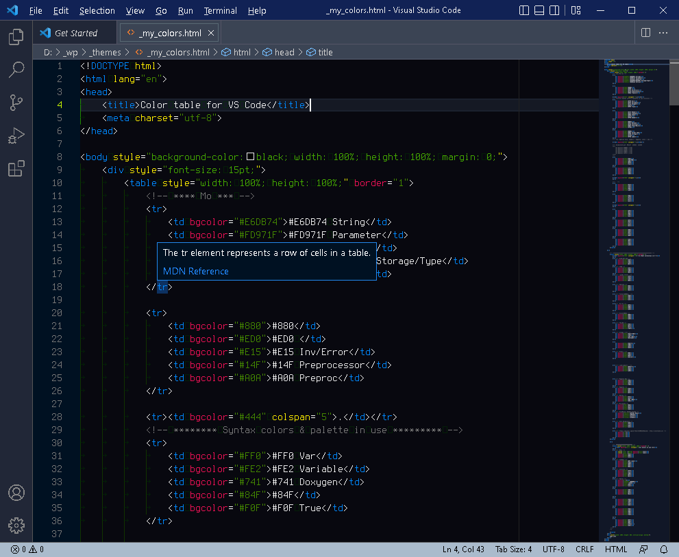
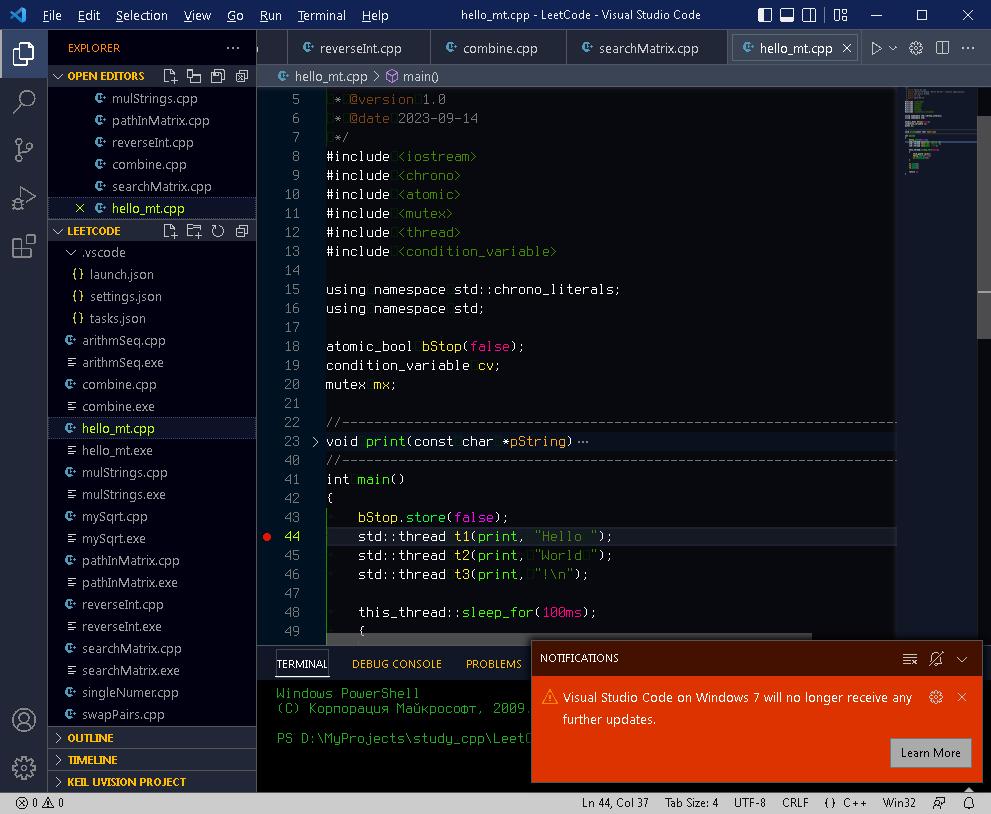

# [Asphalt Theme](https://github.com/makbit/Asphalt-Theme/)

**An innovative and ultra-dark bright color theme for Visual Studio Code.**

  
  
  

---
## Screenshot

	
	

## Description

 - Asphalt Theme is a semantic coloring code theme for comfortable programming.
 - Fancy bright colors are used to hightlight C++/HTML/Java syntax.
 - An innovative color palette features a comprehensive usage of syntax scopes, aesthetics and readability.
 - Unnecessary elements and borders are colored in grayscale, it won't distract you.
 - Theme is mainly focused on C++, Python, HTML/CSS, JavaScript, etc. development.
 - Designed for use with Terminus (TTF) for Windows font 14pt!

## Installation via VS Code

1. Open **Extensions** sidebar panel in VS Code. `View  Extensions`
2. Search for `Asphalt Theme` 
3. Click **Install** to install it
4. Code > Preferences > Color Theme > **Asphalt Theme**
5. Shortcut to select any theme: Ctrl+K, Ctrl+T

### Issues

When you have an issue, tell me through [https://github.com/makbit/Asphalt-Theme/issues](https://github.com/makbit/Asphalt-Theme/issues), or send me an e-mail.

### License

[MIT](./LICENSE.txt)